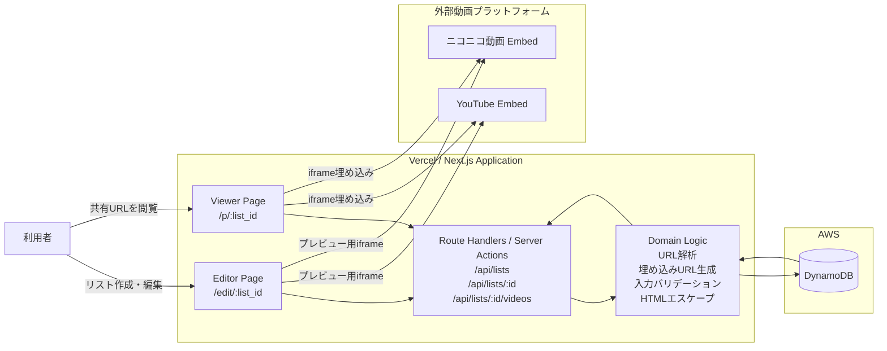
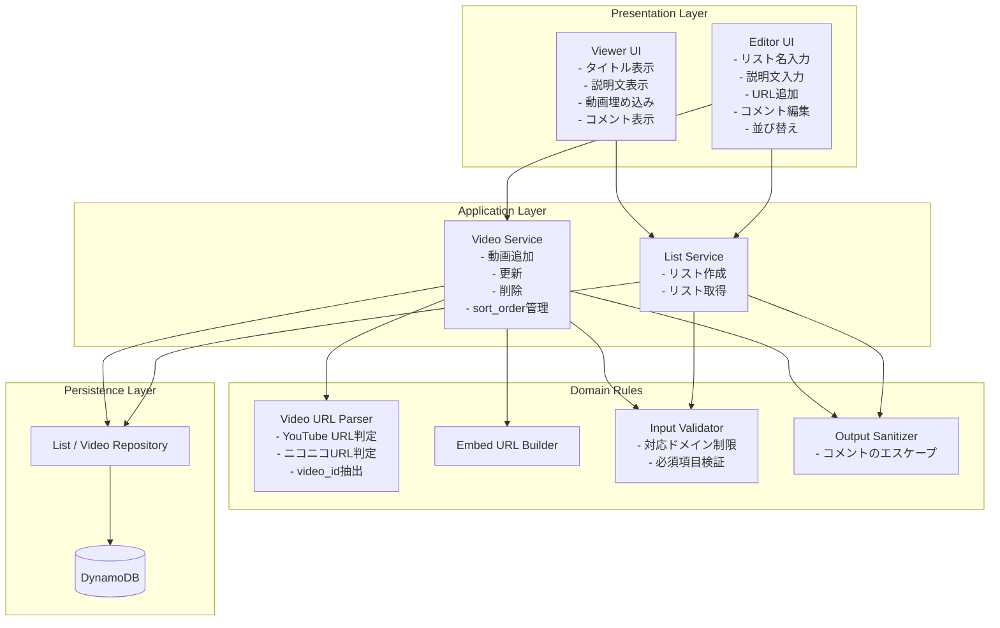
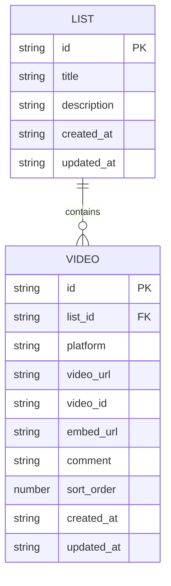
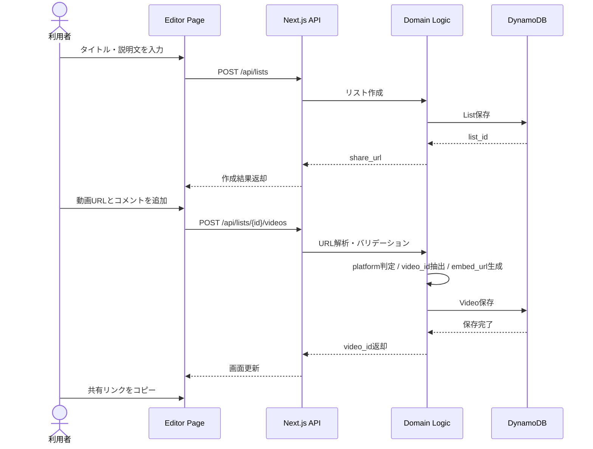
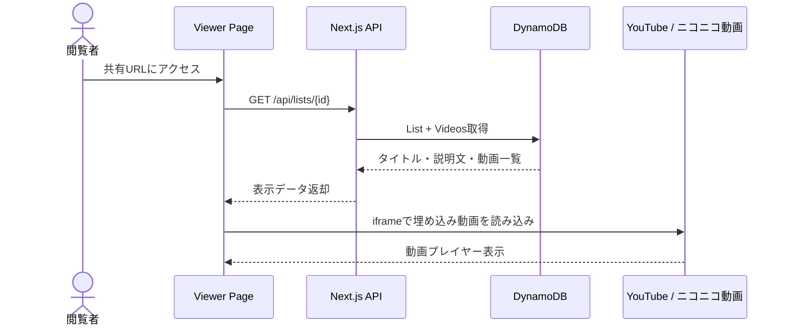

# Video Reference Share Service - MVPアーキテクチャ図

`docs/video-reference-share-mvp-design.md` をもとに、MVP 実装の責務分離とデータの流れを図式化したもの。

## 1. 全体アーキテクチャ

## 2. 論理コンポーネント

## 3. データモデル関係

## 4. 主要フロー

### 4.1 リスト作成から共有まで

### 4.2 閲覧フロー

## 5. インフラ観点の補足

- フロントエンドと API は Next.js に同居させ、MVP の実装速度を優先する
- 永続化対象はメタデータのみで、動画ファイル自体は保持しない
- 外部動画プラットフォームは iframe 埋め込みのみ利用し、コンテンツ配信責務は持たない
- セキュリティ上の要点は URL 許可制、コメントのエスケープ、認証なし編集導線の暫定運用である

## 6. この図で表している前提

- 認証は未導入のため、MVP の編集権限は強くない
- API は REST ベースだが、Next.js の Route Handlers / Server Actions のどちらでも成立する粒度で表現している
- DynamoDB の物理テーブル設計までは踏み込まず、MVP に必要な論理関係を優先している
